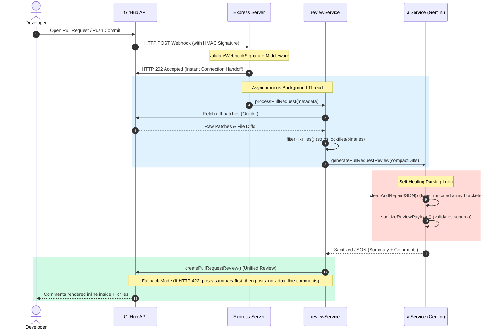

# 🏆 CodeFitsPR AI — Hackathon Submission & Judge Guide

Welcome to the official technical documentation and submission guide for **CodeFitsPR AI**. This document has been prepared specifically for the hackathon judging committee to outline our process, implementation decisions, and architecture in detail.

---

## 🧭 Executive Summary

**CodeFitsPR** is an intelligent, self-healing code review agent that automates the auditing of GitHub Pull Requests. By combining secure event-driven webhooks, custom self-healing JSON parsers, and multi-tier LLM analysis, the system identifies quality, functional, performance, and security issues instantly—posting comments directly back to the pull request lines.

---

## 🎯 Phase 1: The Problem (The Bottleneck in Modern Engineering)

In modern software development, code reviews represent one of the single greatest drags on engineering velocity.

```
       ┌────────────────────────┐
       │   Developer pushes PR  │
       └───────────┬────────────┘
                   │
                   ▼  (Idle Time: Avg. 4 to 24 Hours)
       ┌────────────────────────┐
       │  Reviewer context hops │
       └───────────┬────────────┘
                   │
                   ▼  (Review Time: 30-45 Minutes)
       ┌────────────────────────┐
       │   Vulnerability Leaks  │
       └────────────────────────┘
```

### 1. The Human review bottleneck
Senior developers spend roughly **30% to 40%** of their working hours reviewing other developers' code. This creates a severe cognitive drag, leading to:
* **Reviewer Fatigue**: As deadlines loom, reviewers skip detailed line-by-line checks, scanning only for formatting rather than deep logic bugs.
* **PR Stagnation**: Pull requests regularly sit idle for **4 to 24 hours** waiting for initial human eyes, blocking continuous integration.

### 2. Traditional SAST limitations
Existing static analysis tools (SonarQube, ESLint, etc.) are highly deterministic and syntax-bound:
* They flag basic formatting issues or pre-defined rules, but are blind to **business logic flaws, SQL injection context, API race conditions, or performance N+1 queries**.
* Developers must manage complex configurations (`.eslintrc`, `.yml` pipelines) in every repository.

---

## 💡 Phase 2: The Solution (CodeFitsPR AI)

CodeFitsPR AI replaces slow human passes and complex configs with an **instant, multi-tier automated auditor** that installs in seconds.

```
┌────────────────────────────────────────────────────────────────────────┐
│                          CodeFitsPR AI Core                            │
├───────────────────┬───────────────────┬────────────────┬───────────────┤
│    🔴 Security    │    🟡 Bug Spot    │ 🟢 Performance │ 🔵 Style Check│
│  Hardcoded Keys   │  Race Conditions  │   N+1 Queries  │  Code Quality │
│  SQL Injections   │   Logic Errors    │ Memory Leaks   │ Maintainability│
└───────────────────┴───────────────────┴────────────────┴───────────────┘
```

### 1. Zero-Friction Setup
Instead of writing complex GitHub Action YAML configs in every project, CodeFitsPR AI functions as a **GitHub App**. Once installed, it instantly listens to organization-wide pull request webhooks and automates reviews without polluting your source repositories.

### 2. Deep Multi-Tier Auditing
Upon receiving a PR event, the engine analyzes the diff patches concurrently across four specialized dimensions:
* 🔴 **Security (SAST/SCA)**: Scans for hardcoded tokens, SQL injection vectors, cryptographic weaknesses, and insecure dependencies.
* 🟡 **Bug Detection**: Catches unhandled promise rejections, race conditions, edge-case null pointers, and mathematical logic flaws.
* 🟢 **Performance**: Identifies database N+1 loops, memory leaks, unoptimized loops, and slow operations.
* 🔵 **Style & Readability**: Checks code organization, naming clarity, and adherence to clean coding principles.


---

## 🏗️ Phase 3: The Architecture & Technical Excellence

Our architecture was designed from the ground up for high throughput, data resiliency, and complete defense-in-depth security.

### 1. High-Level Data Flow Lifecycle



---

### 2. Architectural Deep-Dives

#### A. Cryptographic Webhook Security (HMAC-SHA256)
Every payload sent by GitHub is cryptographically verified to guarantee authenticity.
* The backend computes a SHA256 HMAC hash of the raw incoming request body using a private secret key.
* It compares the computed hash against the signature provided in the `x-hub-signature-256` header.
* We use Node's `crypto.timingSafeEqual` function to perform constant-time comparisons, eliminating the risk of side-channel timing attacks.

#### B. Self-Healing JSON Repair Scanning (`cleanAndRepairJSON`)
LLMs are prone to occasional formatting failures, particularly when response buffers are cut off by token limits (Vite/Gemini/GPT max token cuts). Instead of failing, the engine employs a stack-based correction scanner to dynamically rebuild malformed JSON payloads.

##### Truncated Array Recovery:
If a response is cut off in the middle of a comments array (e.g. `[ { "path": "file.js", "line": 12, ...`), the parser:
1. Slices off the trailing incomplete comment block by searching backward for the last complete object bracket (`}`).
2. Scans through the remaining string using a stack-based bracket tracker.
3. Automatically appends matching closing quotes, braces, and brackets (`"`, `}`, `]`) to return a structurally valid JSON string.

```javascript
// Stack scanning algorithm visualization
function closeDanglingBrackets(jsonString) {
  let cleaned = jsonString.trim();
  const stack = [];
  let inString = false;
  let escaped = false;

  for (let i = 0; i < cleaned.length; i++) {
    const char = cleaned[i];
    if (inString) {
      if (escaped) escaped = false;
      else if (char === '\\') escaped = true;
      else if (char === '"') inString = false;
      continue;
    }
    if (char === '"') { inString = true; continue; }
    if (char === '{' || char === '[') stack.push(char === '{' ? '}' : ']');
    else if (char === '}' || char === ']') {
      if (stack.length > 0 && stack[stack.length - 1] === char) stack.pop();
    }
  }
  if (inString) cleaned += '"';
  const closeSequence = [...stack].reverse().join('');
  return cleaned + closeSequence;
}
```

#### C. Unified Review Line-Mapping Fallback
Posting inline comments on GitHub requires exact line mappings matching the file's diff patches. If an LLM hallucinates an invalid line number outside the diff patch limits, GitHub's API rejects the entire transaction with an HTTP `422 Unprocessable Entity` error.

To solve this, CodeFitsPR AI incorporates an intelligent **resilient fallback route**:
1. It catches the unified review error status (`422`).
2. It falls back to post the high-level **Summary Review** first (guaranteeing immediate high-level developer feedback).
3. It extracts the PR commit head SHA and posts each inline comment **individually**.
4. Hallucinated or invalid line items are gracefully logged and skipped, while all valid comments are successfully mapped to their exact code lines.

---

## 📈 Phase 4: Business Value & Scalability

| Metric | Traditional PR Workflow | CodeFitsPR AI Workflow |
| :--- | :--- | :--- |
| **First Review Latency** | 4 to 24 Hours | **< 30 Seconds** |
| **Review Consistency** | Subjective, Variable quality | **Objective, 4-tier structural audit** |
| **Vulnerability Detection** | Post-merge or during build pipelines | **Pre-commit, directly inside PR diffs** |
| **Integration Complexity** | Heavy YAML configs per repository | **Zero-config (GitHub App organization wide)** |

### 🚀 Future Extension Vision
CodeFitsPR AI has been modularly architected to scale seamlessly into next-generation capabilities:
1. **Multi-File Context Indexing**: Using vector embeddings to analyze changes in the context of the entire codebase rather than isolated file diffs.
2. **Interactive AI Conversations**: Allowing developers to reply to the bot's review comments inside GitHub to ask for code implementations, automatically executing corrections on new git commits.
3. **IDE Sync Integration**: Connecting with a VS Code / Cursor extension to allow developers to view automated PR comments inside their local workspaces before pushing code.

---

## 🏁 Conclusion

CodeFitsPR AI elevates automated code review from simple syntax checkers to **highly resilient, deep logic code co-pilots**. It solves real-world developer fatigue, eliminates setup overhead, and implements advanced self-healing logic to handle model constraints gracefully. 

*Thank you for evaluating our project!*
